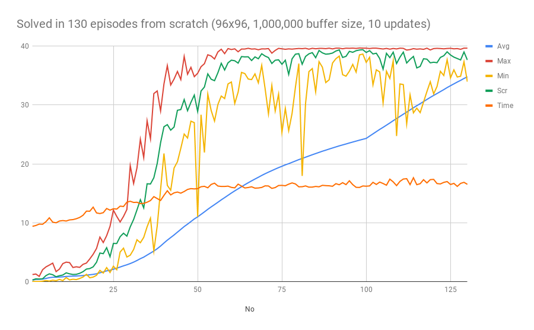
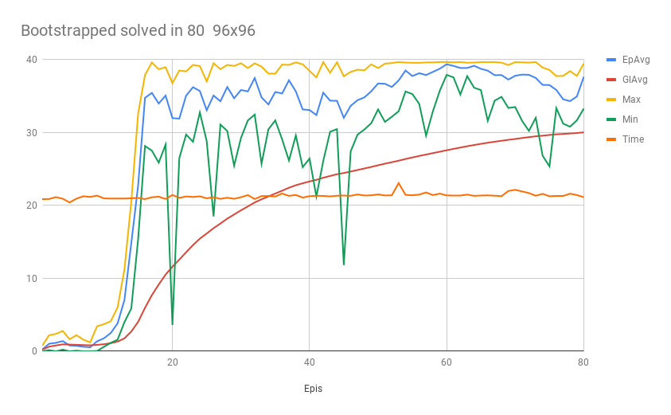
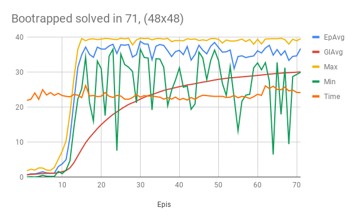
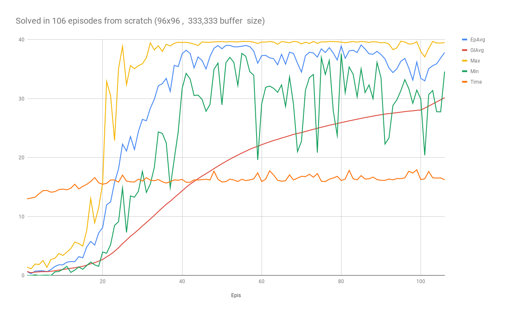
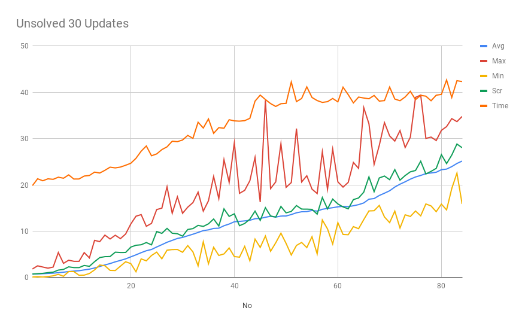

# Report

The algorithm for the agent is DDPG  with possibility of using the several improvements.

## Criteria
The environment was considered solved when the agent achieved average of 30+ over 100 episodes.

## Agent
### Layers
Both actor & critic use two fully connected layers.

### Activations
I sticked with a RELU for the hidden layers and tangens for the final layer. Lately I've trained
quite a lot of classifiers and I don't find other non saturating non-linearities worth the complexity
nor slowdown.

I feel that RELU quickly finds which neurons have signal. As a trick to decrease number of dead RELU
when I feel that model is relying on too few neurons, I sometimes switch to other activation functions
mid training like ELU or SELU to introduce some chaos and then switch back to RELU afterward.

### Neurons
I've settled on a 96 densely connected neurons on the both layers for both actor and critic, since it solved the environment in all the runs I've tried. Using more neurons solved the environment but it took more time. Using little less neurons like 72 took more time. While going to less then 64 neurons usually failed to solve the environment.

I've trained agents with small number of neurons in the model, for example something like 48 neurons.
By itself this agents failed to solve the environments from scratch but when they were trained on experiences from successful agent, the agent was consistently able to solve the environment in record number of steps.

## Improvements

I especially aimed for decreasing the number of episodes needed to solve the environment.

### Number of Neurons
I feel that two layers of 96 neurons is close to optimal, since it consistently solved the environment
from scratch.

### Smaller buffer
I've added second smaller buffer that holds 60,000 steps which reduced the training time. 
It has an effect of the agent focusing on the latest episodes.

### Decreasing the main buffer
Smaller buffer converges faster when training from scratch, this cut the episodes by around 10.
The problem is that smaller buffer sometimes leads to instabilities during training. 
You can see that at later episodes, minimal value is suboptimal.

### Number of updates
This is hyperparameter that showed quite a lot of promise. I've started with default of 10, tried increasing it to 30 but that made the training unstable and performed worse. 

I've settled on 15 updates from the main buffer, and 3 updates from the small buffer. 

## Potential improvements
I believe that solving the environment in around 100+ episodes consistently is quite good.
I didn't want to invest more time since the real learning happens before the 40th episode, as soon as the agent achieves 30 it stays stable. Afterward its just overwriting the previous bad results. 

## Failed improvements
Actually the environment with 20 agents was easy to solve even with minimal adaptation of the default agent. However I'm unable to solve the single reacher environment. 

### Tiling
I've tried stacking several frames, I've experimented tiling 2 to 4 frames but without much effect.

### Swarm
I've tried using several agents with shared experience buffer, but it didn't do any good. Sometimes some
agent finds good policy but its very unstable since most of the experience in the buffer is garbage.

### Prioritizing experience
I've tried different ways to boost training with the best episodes or several steps before reward but again to no awail. There are very few steps that lead to reward, and agents practically trains without
signal coming from the reward. In the environment with 20 agents, random chance gives agent reward that
enables backpropagation to learn. 

In the end I feel there is very little information coming from one episode in the single agent environment so either agent doesn't learn or it learns very slowly. I've waited for thousands of episodes and improvement is glacial and unstable. And since it takes similar time for the both single and 20 agents environment to process a single step, the learning process for the single player environment is very frustrating.

## Update
I've managed to solve the single agent environment by using several changes.

### Random runs
I prefill the large buffer with 300+ episodes of experience generated by untrained agent.
Until the large buffer is filled at 33% capacity I don't start learning.

### Resetting agents
During the prefill process I reset the agent weights after every episode to get more random policies.

### Learn less often
Since the vairety and the quality of the experiences is lower then in 20 agents environment I train less often.
